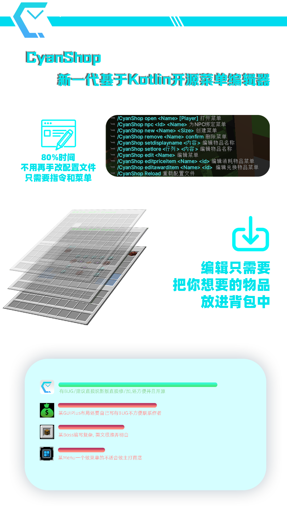

# CyanShop

## admin command

| command                        | description           |
|--------------------------------|-----------------------|
| `cs help`                      | 帮助                    |
| `cs Reload`                    | 重载                    |
| `cs saveTempItem`              | 在config显示背包物品         |
| `cs test`                      | 获取config以列表的形式获取      |
| `cs saveTempItemSimple`        | 保存手里的                 |
| `cs edit <name>`               | 编辑商店菜单                |
| `cs npc <id> <menu>`           | 绑NPC                  |
| `cs new <menu> <几层>`           | 创个新的menu              |
| `cs remove <menu> confirm`     | 删除menu                |
| `cs editPriceItem <menu> <id>` | 编辑需要花费的物品             |
| `cs editAwardItem <menu> <id>` | 编辑兑换的的物品              |
| `cs list`                      | 查看已有菜单                |
| `cs setdisplayname <内容>`       | 设置自定义物品名字支持颜色但不支持空格   |
| `cs setlore <行数> <内容>`         | 设置自定义物品Lore支持颜色但不支持空格 |

## player command 

| command          | description |
|------------------|-------------|
| `cs open <menu>` | 打开菜单        |

## 制作人

- [CyanBukkit]()
- [ChatGPT]()(感谢3.5岁的GPT帮我把itemstack判定解决了)

## 版本更新 

 - 1.2.2
    - 修复了一个bug
    - 优化了代码
    - 优化了配置文件

